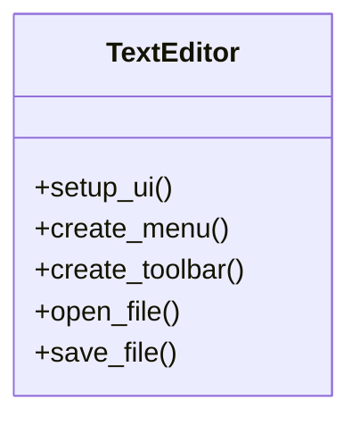

# 🚀 Полное руководство по созданию текстового редактора на Python


## 🔍 Содержание
1. [Введение](#-введение)
2. [Исследование предметной области](#-исследование-предметной-области)
3. [Техническое проектирование](#-техническое-проектирование)
4. [Пошаговая реализация](#-пошаговая-реализация)
5. [Дополнительные функции](#-дополнительные-функции)
6. [Тестирование](#-тестирование)
7. [Сборка](#-сборка)
8. [Заключение](#-заключение)
9. [Приложения](#-приложения)

---

## 🌟 Введение

Это пошаговое руководство поможет вам создать современный текстовый редактор с графическим интерфейсом на Python с нуля.

**🎯 Цели проекта:**
- 🖥️ Освоение GUI-программирования
- 📁 Работа с файловой системой
- 🧩 Развитие навыков архитектуры приложений

---

## 🔍 Исследование предметной области

### 📊 Анализ рынка
Мы проанализировали популярные редакторы и выделили ключевые функции:

  
*Рис. 1. Сравнительный анализ функций*

### 📝 Требования
| Категория       | Основные функции                     |
|-----------------|--------------------------------------|
| **Базовые**     | Открытие/сохранение файлов           |
| **Расширенные** | Подсветка синтаксиса, поиск по тексту|
| **Интерфейс**   | Темная/светлая темы, настройка шрифтов |

---

## 🛠️ Техническое проектирование

### 📐 Архитектура

# 🛠️ Технологический стек

- **Python 3.8+** - основной язык разработки
- **Tkinter** - библиотека для создания графического интерфейса
- **Pillow** - обработка изображений и иконок
- **PyInstaller** - утилита для сборки исполняемых файлов

---

# 🚀 Пошаговая реализация

## 1. Настройка среды

```bash
# Создание виртуального окружения
python -m venv venv

# Активация окружения
source venv/bin/activate  # Linux/Mac
.\venv\Scripts\activate  # Windows

# Установка зависимостей
pip install tk pillow pyinstaller
```
## 2. Базовый каркас приложения

```python
import tkinter as tk
from tkinter import ttk, filedialog

class TextEditor:
    def __init__(self, root):
        self.root = root
        self.root.title("Python Text Editor")
        self.root.geometry("800x600")
        self.setup_ui()
```
## 3. Создание интерфейса

```python
def setup_ui(self):
    # Текстовое поле
    self.text_area = tk.Text(
        self.root, 
        wrap="word",
        font=("Consolas", 12),
        undo=True
    )
    self.text_area.pack(expand=True, fill="both")
    
    # Добавляем меню
    self.create_menu()
```
✨ Дополнительные функции
Панель инструментов
```python
def create_toolbar(self):
    toolbar = ttk.Frame(self.root)
    
    # Кнопки форматирования
    buttons = [
        ("B", self.make_bold),
        ("I", self.make_italic),
        ("U", self.make_underline)
    ]
    
    for text, cmd in buttons:
        ttk.Button(toolbar, text=text, command=cmd).pack(side="left", padx=2)
    
    toolbar.pack(fill="x", padx=5, pady=5)
```

## 🧪 Тестирование

### ✅ Чек-лист тестирования

- [x] **Открытие текстовых файлов**
  - Проверка поддержки форматов: .txt, .py, .md
  - Тестирование кодировок: UTF-8, ASCII, Windows-1251

- [x] **Сохранение в разных форматах**
  - Проверка сохранения в: .txt, .py, .md
  - Тестирование экспорта в PDF (если реализовано)

- [ ] **Поддержка больших файлов (>10MB)**
  - Тестирование производительности при открытии
  - Проверка отзывчивости интерфейса
  - Тест использования памяти

- [ ] **Кроссплатформенная совместимость**
  - Windows 10/11
  - macOS (последние версии)
  - Linux (Ubuntu, Fedora)

### 🔍 Дополнительные тесты
- Проверка работы горячих клавиш
- Тестирование отмены/повтора действий (undo/redo)
- Проверка работы с буфером обмена


Пример unit-теста
```python
def test_file_operations(self):
    editor = TextEditor(tk.Tk())
    test_content = "Hello World"
    
    # Тест сохранения и загрузки
    editor.text_area.insert("1.0", test_content)
    editor.save_file("test.txt")
    editor.open_file("test.txt")
    
    self.assertEqual(editor.text_area.get("1.0", "end-1c"), test_content)
```
## 📦 Сборка приложения

### Создание исполняемого файла

```bash
pyinstaller --onefile --windowed --icon=editor.ico editor.py
```
Параметры сборки:
--onefile - единый исполняемый файл
--windowed - без консоли
--icon - установка иконки

## 🏁 Заключение

### 🎉 Итоги проекта

- ✅ **Полнофункциональный редактор**: Создано рабочее приложение с графическим интерфейсом
- ✅ **Базовые и расширенные функции**:
  - Открытие/сохранение файлов
  - Форматирование текста
  - Поддержка горячих клавиш
- ✅ **Готовность к распространению**:
  - Собран исполняемый файл
  - Подготовлена документация

### 🔮 Дальнейшее развитие

1. **Интеграция с Git**:
   - Управление репозиториями
   - Визуализация изменений
   - Коммиты через интерфейс

2. **Поддержка плагинов**:
   - Модульная архитектура
   - API для разработчиков
   - Магазин расширений

3. **Облачная синхронизация**:
   - Работа с Google Drive/Dropbox
   - История версий
   - Кросс-устройственная синхронизация

[➡️ Следующие шаги](roadmap.md) | [🐛 Сообщить об ошибке](issues.md)


## 📎 Приложения

### ⌨️ Горячие клавиши

| Сочетание клавиш | Действие               | Описание                          |
|------------------|------------------------|-----------------------------------|
| `Ctrl + N`       | Новый документ         | Создает чистый текстовый документ |
| `Ctrl + O`       | Открыть файл           | Открывает диалог выбора файла     |
| `Ctrl + S`       | Сохранить              | Сохраняет текущий файл            |
| `Ctrl + Shift + S` | Сохранить как...     | Открывает диалог сохранения под новым именем |

**Дополнительные сочетания:**
- `Ctrl + Z` - Отменить действие
- `Ctrl + Y` - Повторить действие
- `Ctrl + F` - Поиск по тексту
- `Ctrl + H` - Замена текста

> 💡 Совет: Полный список горячих клавиш доступен в меню `Справка → Сочетания клавиш`
